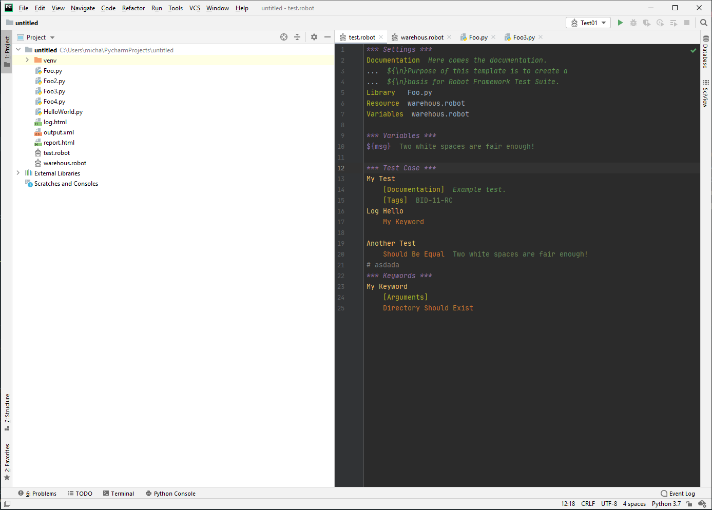
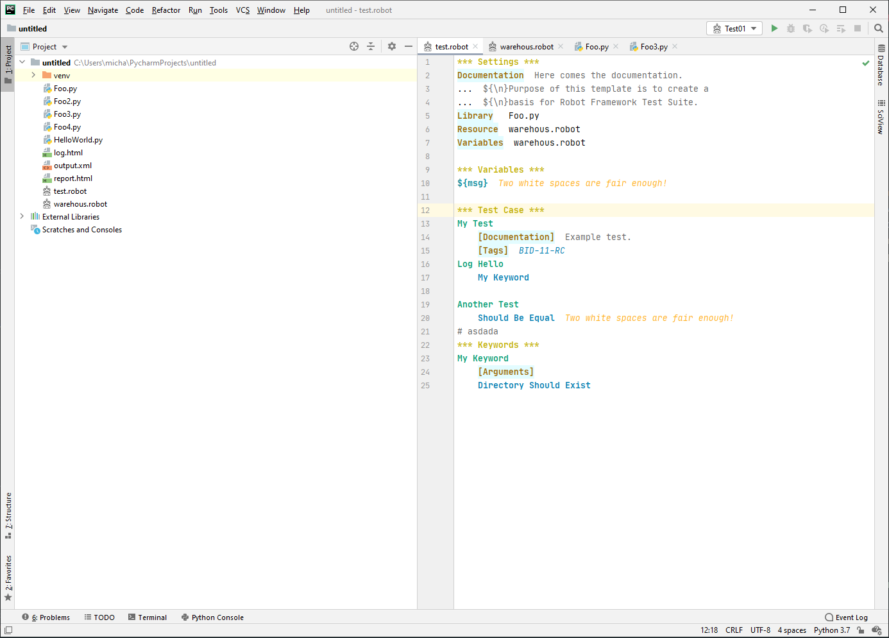
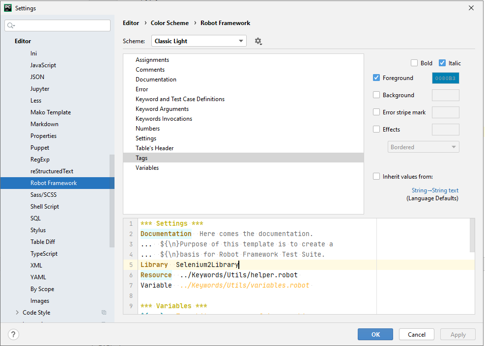
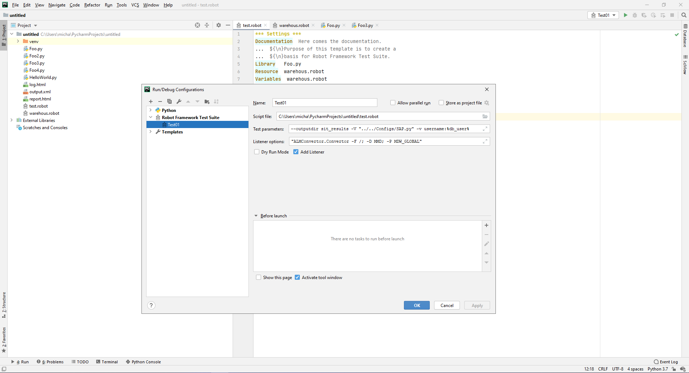
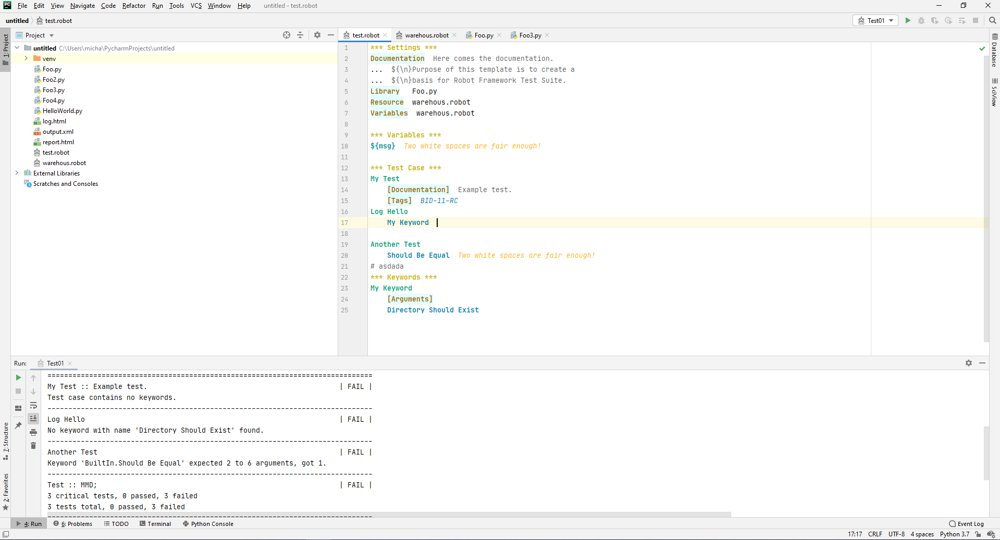
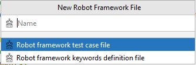

# Robot Framework Cognitive Plugin - RobocCoP

  A purpose of this project is to develop an extending plugin for PyCharm IDE   which will support automation test development in the Robot Framework.
  This project is being developed as for now as a course project of NPRG021-Advanced programming on Java platform, taken on Faculty of Mathematics
  and Physics on Charles University in Prague and afterwards will be developed and maintained under Apache License Version 2.0 to provide continuous support and features.

|RoboCoP | Release 1.0              |
|--------|---------------------------|
|Release Scope | - Syntax Highlighting <br> - Configuration of test execution <br> - Library and Resource referencing <br> - New File from template action | 
|Issue Date | 02-Sep-2020 |
|Developer| Michal Kyjovsky |

## Installation

**NOTE:**
- Steps below describes how to run the plugin locally from IntelliJ IDEA for development purposes, as for now it will be not published to the official JetBrains repository.  

#### **Prerequisites:**
- Installed ***JDK 11+***
- Installed ***Gradle***
- Installed ***Git***

####**Steps:**
- Clone the ***RoboCoP*** project into your local machine
```
 git clone https://github.com/MichalKyjovsky/RoboCoP.git
```
- Navigate to the root folder and build the plugin
```
 ./gradlew buildPlugin
```
- After the plugin built run the plugin
```
 ./gradlew runIde
``` 
- The PyCharm IDE will start in a development mode.

## Provided functionalities 
####***Syntax highlighting***
 - RoboCop plugin provides full language syntax highlighting for Robot Framework tokens defined by the language grammar.
  
  
 - For the user's preferences is introduced a color palette enabling customization of syntax highlighting. 
   To adjust default configuration please navigate to:
 > Settings > Editor > Color scheme > Robot Framework
  
  
####***Configuration execution***
 - RoboCop plugin provides configurable execution in configuration section.
 - User can configure execution with all Robot Framework options, include an external listener, and execute test cases in dry-run mode.
 - **IMPORTANT NOTICE:** Python interpreter must be set in order to execute the ROBOT test scripts directly from IDE.
 
 

####***New Robot file action***
 - RoboCop plugin also enables user to create the .robot file directly from the Actions menu.
 > File > New > New Robot File
 - Above described action enables to create two types of .robot files, either the Robot Framework Test Case
 file consisting each of the Robot Framework tables, or the Keyword Definition file storing Variables and Keywords section.
 Both files are templated, therefore after creating any of them, user automatically has a template wo start with.   
 

